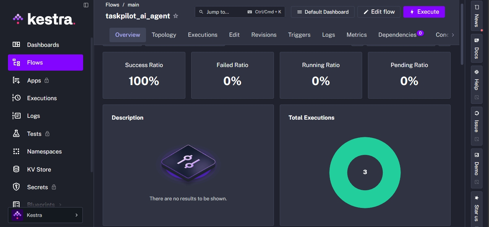
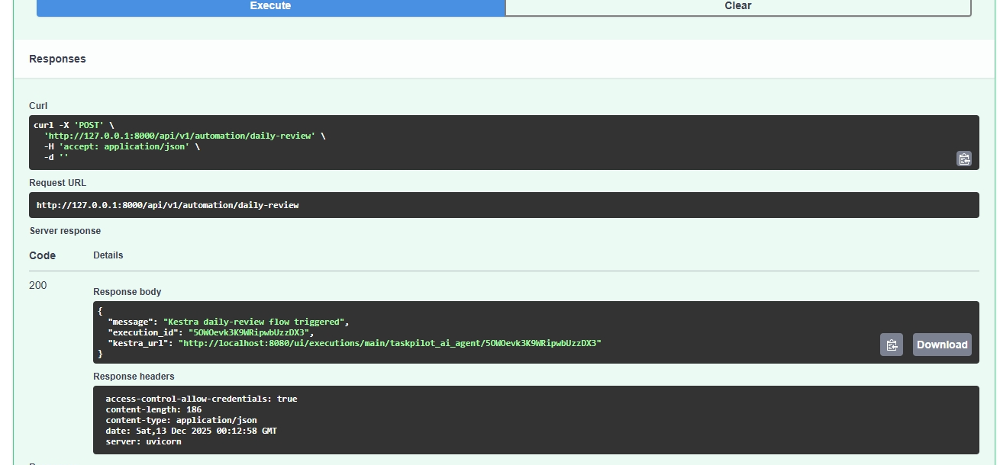
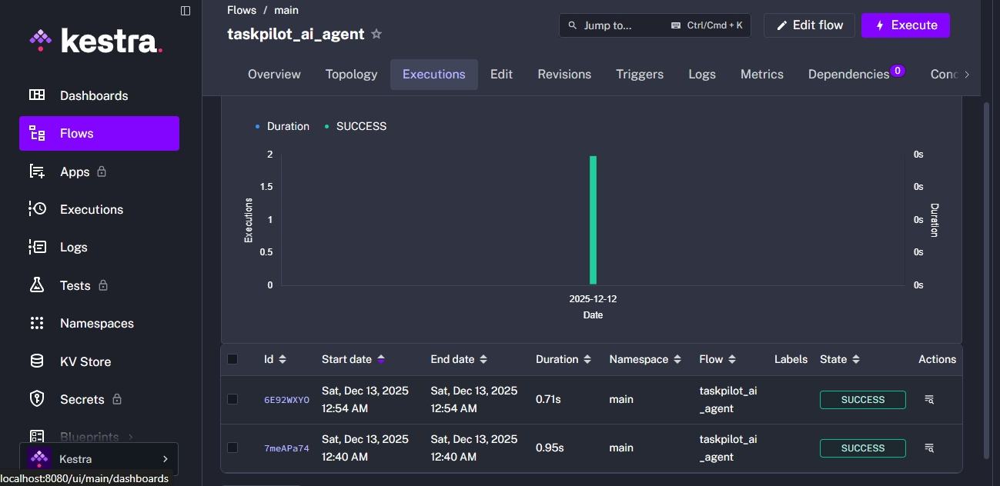
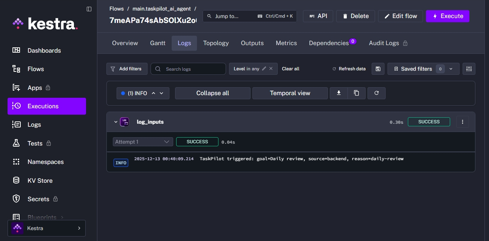

## 🤖 Automation Demo — Daily Review Agent (Kestra)

This demo shows how TaskPilot triggers an AI automation workflow using **Kestra**.

---

## Prerequisites
- Docker & Docker Compose installed
- Backend running on `http://localhost:8000`
- Kestra running on `http://localhost:8080`
- Backend env vars set (must match Kestra basic-auth):
  - `KESTRA_USERNAME`
  - `KESTRA_PASSWORD`
  - `KESTRA_BASE_URL` (optional, default `http://localhost:8080`)
  - `KESTRA_TENANT` (optional, default `main`)
  - `KESTRA_NAMESPACE` (optional, default `main`)
  - `KESTRA_FLOW_ID` (optional, default `taskpilot_ai_agent`)

---

## 1️⃣ Start Kestra

```bash
cd kestra
docker compose up -d
```

Open the Kestra UI:
<http://localhost:8080>

## 2️⃣ Verify the Flow Exists

Ensure the flow taskpilot_ai_agent exists in the main namespace.

In the Kestra UI:

Flows → main → taskpilot_ai_agent

### Kestra Flow Loaded



## 3️⃣ Trigger Automation from Backend

Trigger the automation via the backend API:
```bash
curl -X POST http://localhost:8000/api/v1/automation/daily-review
```

Expected Response
```json
{
  "message": "Kestra daily-review flow triggered",
  "execution_id": "...",
  "kestra_url": "http://localhost:8080/ui/executions/main/taskpilot_ai_agent/<id>"
}
```

### Backend Trigger Response


## 4️⃣ View Execution in Kestra

Open the returned kestra_url in your browser to inspect the execution.

### Kestra Execution View


## 5️⃣ Kestra Logs

Execution logs generated by the flow:


## 6️⃣ (Optional) Manual Execution from UI

You can also execute the flow manually via the Kestra UI by providing:

goal

source

reason

due date

This is useful for live demos and screenshots.

✅ Result

TaskPilot successfully triggers an automated workflow via Kestra, proving:

Backend → automation orchestration

Event-based execution using Kestra

An extensible AI agent pipeline